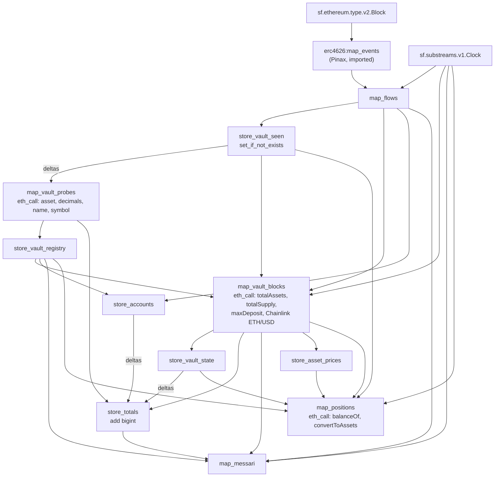

# plimsoll_erc4626

A Substreams package that turns raw ERC-4626 `Deposit` / `Withdraw` logs into
something you can act on:

- a vault registry;
- normalised share prices, with entry and exit rates kept apart;
- TVL;
- nominated holder positions for coverage attestation;
- Messari Yield Aggregator v1.3.1 entities.

It runs on Ethereum mainnet and Base from a single spkg.

It builds on Pinax's `erc4626` extractor
([pinax-network/substreams-evm#259](https://github.com/pinax-network/substreams-evm/pull/259)),
imported by URL and run unchanged (same module hash, so Pinax's server-side
cache is reused). Pinax's module is deliberately events-only. Its README leaves
the share price, decimal normalisation and vault disambiguation to "downstream".
This package is that downstream.

Nothing ERC-4626 existed on substreams.dev before this. Registry searches for
`erc4626`, `erc-4626` and `tokenized-vault` all returned empty, and Pinax does
not publish to the registry.

## Module graph



| Module | Kind | Output | Purpose |
|---|---|---|---|
| `map_flows` | map | `plimsoll.erc4626.v1.Flows` | Flattens Pinax's per-transaction output and adds block number, hash and timestamp. Pinax's output has none of these, and a price series is useless without them. Params: optional comma-separated vault allowlist. |
| `store_vault_seen` | store, `set_if_not_exists` | string | First sighting of each emitter, and of each event side (`d:` / `w:`). Its deltas are exactly "new address this block". |
| `map_vault_probes` | map | `VaultInfos` | Two batched `eth_call` rounds per block that has new addresses. The first gets `asset()`, `decimals()`, `name()` and `symbol()` on the vault; the second gets `decimals()`, `name()` and `symbol()` on the underlying. Runs once per address, ever. |
| `store_vault_registry` | store, `set` | `VaultInfo` | The registry, rejected addresses included. |
| `map_vault_blocks` | map | `VaultBlocks` | **The series.** Params: the network's pricing table. Per vault per block with flows: raw and normalised sums, signed net flow, `entry_rate`, `exit_rate`, `fee_spread_bps`, end-of-block `totalAssets` / `totalSupply` / `state_price`, `rates_consistent`, USD price and TVL, plus block number, hash and timestamp. |
| `store_vault_state` | store, `set` | `VaultBlock` | Latest state per vault. Its deltas carry old and new values, and that is how revenue is computed without a cycle in the graph. |
| `store_accounts` | store, `set_if_not_exists` | int64 | First sighting of each share owner, for `cumulativeUniqueUsers`. |
| `store_totals` | store, `add` | bigint | Cumulative flows, revenue (asset wei and USD×1e18), protocol TVL, pool and user counts. |
| `map_messari` | map | `messari.yield_aggregator.v1.Entities` | Messari Yield Aggregator v1.3.1: `YieldAggregator` (with `schemaVersion` / `subgraphVersion` / `methodologyVersion`), `Vault`, `VaultFee`, `Token`, `Deposit`, `Withdraw`. |
| `store_asset_prices` | store, `set` | string | Last USD price per underlying, as `price@block`, so a position can say how old its price is. |
| `map_positions` | map | `Positions` | Nominated `(note, holder, vault)` positions. It reads `balanceOf(holder)` and then `convertToAssets(shares)` by `eth_call` on a cadence, and also in any block where a nominated vault moved. The block's `VaultBlocks` ride along, so one stream serves both vault and note queries. Params: `every=<blocks>;<noteId>=<holder>:<vault>,<vault>;…` |

## The three holes Pinax documents, and what this package does about them

**1. Signature-only matching.** Pinax matches `topic0` with no address list, so
any contract with a same-signature event gets through. This package stacks three
filters:

- `asset()` must return a clean address whose `decimals()` answers. Otherwise
  the emitter is `VERIFICATION_REJECTED` and is excluded from every derived
  output.
- `verification` is `CONFIRMED` only once both `Deposit` and `Withdraw` have
  been seen on the address. `ASSET_PROBE` means only one side has been seen so
  far.
- `rates_consistent` is set per block. It is false when the event-implied rate
  is more than 10 % above, or any meaningful amount below, the vault's own
  end-of-block price.

This is not theoretical. In the first 300 blocks from 25,940,000, 5 of 126
emitters failed the `asset()` probe: Staked Spark (stSPK), Staked Grove
(stGROVE), Yield Basis yb-WETH, Clear USD, and an unnamed contract. All 5 were
re-checked on an independent archive RPC at the same block, and `asset()`
reverts on every one. A sixth, `0x4f95c5ba…`, passes the probe (its `asset()` is
USDC) but reports `totalAssets` of 170 USDC against 96.9M shares, while its
deposits imply a price near 1. Before the consistency flag existed, this one
contract produced 95 % of the whole chain's "fee revenue" in that window. That
is exactly the confident wrong answer a topic0-only feed produces.

Over 5,000 blocks, 475 vaults had flows, and 43 of them were flagged
`rates_consistent = false` at least once. Examples:

- a contract over USTB whose withdrawals pay 287 % above its own
  `totalAssets / totalSupply`;
- staked-steakEUR wrappers paying 2.3 % above;
- several vaults that mint shares far below their own price.

None of the nine named vaults below was ever flagged.

The flag itself had a hole, and the MCP server's replay of recorded live
output found it. At block 25,955,928, `0x4f95c5ba…` reported
`totalAssets = 0` while a withdrawal went through at rate 1. With a zero
price, the premium and discount cannot be computed, and the first version
treated "cannot compute" as "in band". Since v0.2.0 a side that traded
must have a computable deviation, and a zero price is never consistent
(`consistent()` in `src/lib.rs`, with a unit test for the zero-price case).

**2. The fee spread.** `Deposit.assets` is gross of entry fees and
`Withdraw.assets` is net of exit fees. So for a conforming vault,
`entry_rate ≥ price ≥ exit_rate`. The package reports `entry_rate` and
`exit_rate` separately, never blended, and adds `fee_spread_bps`,
`entry_premium_pct` and `exit_discount_pct` measured against the end-of-block
price. Messari `VaultFee.feePercentage` for `DEPOSIT_FEE` / `WITHDRAWAL_FEE` is
the observed premium or discount, and is set only when the rates are consistent.

**3. Virtual-share offset.** OpenZeppelin's inflation-attack defence gives
shares more decimals than the asset. MetaMorpho USDC, for example, has 18-decimal
shares over a 6-decimal asset, so a raw `assets / shares` is off by 10¹². Every
rate here is `(assets / 10^assetDecimals) / (shares / 10^shareDecimals)`,
computed in exact integer arithmetic at 18 fractional digits (`src/math.rs`).
There are no floats anywhere in the pipeline.

## eth_call: yes, and what it costs

Substreams can make `eth_call`s. The API is
`substreams_ethereum::rpc::eth_call(&RpcCalls)`, or the `RpcBatch` wrapper, in
`substreams-ethereum` 0.11. The host pins every call to **the hash of the block
being processed**, so replays are deterministic and the result is state as of
the end of that block. Verified live on `mainnet.eth.streamingfast.io:443` (The
Graph Market).

Cost is latency, one round trip per batch, and not money. The Graph Market's
published meters are processed blocks and egress bytes, with no per-call meter.
This package batches everything:

- `map_vault_probes` makes at most 2 requests in a block that has new addresses,
  and none otherwise.
- `map_vault_blocks` makes 1 request per block with flows: 3 calls per touched
  vault, plus 1 Chainlink call when a WETH vault is touched.

In the first 300 blocks, 159 blocks had flows across 121 vaults. The run took
25 s end to end and processed 618 blocks, stores included.

Minimal ABI encoding and decoding is hand-rolled in `src/abi.rs`, covering
eight fixed selectors, all checked with `cast sig`. `string` falls back to
`bytes32` for MKR-style tokens.

## Networks

One spkg serves both chains. The manifest's `networks:` section gives each chain
its own initial block and parameters, and you choose one with `--network`. No
chain's addresses are compiled into the WASM. The pricing table (peg
stablecoins, WETH and the Chainlink ETH/USD feed) is a module parameter of
`map_vault_blocks`.

| | mainnet | base |
|---|---|---|
| endpoint | `mainnet.eth.streamingfast.io:443` | `base-mainnet.streamingfast.io:443` |
| initial block | 25,940,000 | 51,150,000 |
| peg stablecoins | USDC, USDT, DAI, USDS, USDe, PYUSD, GHO, crvUSD, FRAX | USDC, USDbC, DAI, USDS, USDe, USDT |
| WETH | `0xc02a…6cc2` | `0x4200…0006` |
| Chainlink ETH/USD | `0x5f4e…8419` | `0x7104…bb70` |
| `map_positions` cadence | every 50 blocks (≈10 min) | every 150 blocks (≈5 min) |

Every address was checked on-chain at a pinned block: tokens by `symbol()` and
`decimals()`, feeds by `description()` = "ETH / USD" and `decimals()` = 8.
Mainnet was checked at 25,953,495 and Base at 51,173,787. EURC is deliberately
absent from Base's peg list, because it is not a dollar.

- **Base streams through The Graph Market.** 200 blocks from 51,171,800 on
  `base-mainnet.streamingfast.io:443`, with the same JWT, produced 99 ERC-4626
  flows across 30 vaults. Pinax's extractor is chain-agnostic, as its README
  says.
- **The refactor that moved pricing into params changed nothing.** v0.2.0 and
  v0.1.0 produce byte-identical `map_vault_blocks` output on all 159 of the 159
  blocks with flows in 25,940,000–25,940,299.
- **Positions read live on Base.** `map_positions --network base` ran on The
  Graph Market over 300 blocks from 51,180,961. That included backfilling the
  stores from 51,150,000: 48,919 blocks processed in 6 min 49 s. It nominated
  two holders of a `CONFIRMED` USDC vault, `0x050ce30b…56f0`:
  - a public depositor: 19,252,669.19 shares, which `convertToAssets` valued at
    20,041,735.86 USDC;
  - the issuer address: exactly `0` shares. That is a successful call that
    returned zero, which is not the same as `ok = false`.

  Positions were read in 45 of the 300 blocks: every block in which the vault
  moved, plus the cadence ticks.
- **Every Base position reading is wei-exact against an independent archive
  node: 90/90.** `scripts/crosscheck_positions.py` re-asks drpc, Tenderly and
  Blast for the same `balanceOf(holder)` and `convertToAssets(shares)` at the
  same block. It checks exact equality, with no tolerance. The same check on
  mainnet (`map_positions --network mainnet`, 100 blocks from 25,955,987, an
  sUSDe holder and a Spark Blue Chip USDC holder of 9,167,201.45 shares worth
  9,508,219.33 USDC) gives 10/10.
- **Messari entities on Base.** `map_messari --network base`, 200 blocks at the
  head: protocol `erc4626-base` (`network: BASE`, `schemaVersion` 1.3.1), 374
  pools, 4,728 unique users and $2.19B TVL marked since the Base initial block;
  e.g. Spark USDC Vault `0x7bfa…f34a` at $279.3M TVL and 1.0786 USDC per share.
- **Base pricing works end to end.** 143 USDC vault-blocks were marked at 1, and
  5 WETH vault-blocks at the Base Chainlink price (2,541.93), across 35 vaults.

## Positions and notes

`map_positions` exists to feed coverage attestation. For each nominated
`(note, holder, vault)`, it reports:

- `shares`: `balanceOf(holder)`;
- `assets`: `convertToAssets(shares)`, which is the vault's own valuation,
  rounded down;
- the asset, both decimals, the USD value and the block the price was taken at;
- the vault's registry verdict and its last `rates_consistent`.

Every reading carries the block number and block hash. If any call reverts, the
position is `ok = false` and its amounts are **empty, never zero**, because a
zero would read as a finding.

Note definitions live in [`notes.json`](notes.json), which the MCP server and
the attestor both read. **It holds only what the chain cannot say:**

- the network that holds the backing;
- the vault list, the preimage of the `vaultSetHash` registered in
  CoverageOracle;
- whether the note is a negative control;
- where the on-chain facts live.

The file never contains a liability, a threshold or a holder. A number the
issuer typed into a config file is exactly what Plimsoll exists to refuse. All
of these are read from the chain at the moment of use:

| Fact | Source (Hedera testnet) |
|---|---|
| outstanding | the note's `totalSupply()`. Notes in the issuer's own wallet count, because they can be sold in one transaction. |
| par | the note's nominal value and its decimals, from ATS |
| threshold | `LoadLine.lineOf(noteId)`, e.g. 9,500 bps for PLIM-A |
| holder | the single member of the note's `ROLE_ISSUER`. It is derived, so the service cannot be pointed at someone else's position. |
| registered vault set | `CoverageOracle.noteOf(noteId).vaultSetHash` |

`scripts/check_notes.py` enforces the file's side of this:

- It reproduces three `canonicalHash` vectors pinned from the attestor's own
  compiled `canonical.js`. That proves `vaultSetHash` is computed byte for byte
  as `packages/attestor/src/canonical.ts` computes it.
- It recomputes each `noteId` as `keccak256(market)`.
- It derives each note's holder on-chain.
- It **fails** when:
  - `canonicalHash(sorted vaults)` differs from the hash registered on
    CoverageOracle;
  - two notes with the same holder share a vault, which would let the same
    collateral be pledged twice.

The backing is a real position on Base. The holder
`0xa9f24d9633bf74d4893c6687cd2c9f4ecd6f413a` is the same ECDSA key as the
issuer's Hedera operator account `0.0.10448897`: the issuer's Hedera identity
and its Base holder address are literally the same address.

`notes.json` holds two notes, both backed on Base by that one holder:

- **PLIM-A** is the negative control. Its real on-chain obligation is 10,000
  notes at a nominal of 100.00, so $1,000,000 against about $15 of backing, and
  it must always refuse.
- **PLIM-B** is the right-sized series: 1,000 base units at 2 decimals with a
  nominal of 100 at 2 decimals, so a $10.00 obligation, and a LoadLine
  threshold of 10,000 bps against PLIM-A's 9,500. This is the note that should
  clear.

Both are registered in CoverageOracle with a placeholder vault set, and each
placeholder is a different convention: PLIM-A's `0x2627c1d5…` is
`sha256("plimsoll/vaults/v1")`, and PLIM-B's `0x504c…` is the ASCII string
`PLACEHOLDER-NOT-A-VAULT-SET`. Neither is the hash of a vault list, so
`check_notes.py` fails on both until `setVaultSet` is called with the final
sets.

## Versions

| Version | Manifest | Scope |
|---|---|---|
| v0.1.1 | `substreams.v0.1.1.yaml` | Ethereum mainnet: registry, series, Messari view |
| v0.2.0 | `substreams.yaml` | adds Base and the positions modules (`store_asset_prices`, `map_positions`) |

v0.1.1 supersedes v0.1.0, which was built but never published. v0.1.0 had a
hole in `rates_consistent`: a vault reporting `totalAssets = 0` has no
computable premium or discount, and "cannot compute" was treated as "in band",
so a zero-priced vault with flows counted as consistent. Replaying live output
through the MCP server found it (mainnet block 25,955,928,
`0x4f95c5ba…`). Since v0.1.1 a zero price is never consistent. Prices, rates
and totals were never affected, only that flag and the fee revenue gated on it.

## Run it

Requirements: the `substreams` CLI ≥ v1.21, Rust with the
`wasm32-unknown-unknown` target, and [`buf`](https://buf.build/docs/installation)
on `PATH` for protobuf generation. On Git Bash for Windows, add `buf` to `PATH`
as `/c/...`, not `C:/...`: the colon splits the entry.

```bash
cp .env.example .env    # then fill in SUBSTREAMS_API_TOKEN
export $(grep -v '^#' .env | xargs)
substreams build

# the per-vault series (what a risk or attestation service reads)
substreams run substreams.yaml map_vault_blocks \
  -e mainnet.eth.streamingfast.io:443 -s 25940000 -t +300 -o jsonl

# Messari entities
substreams run substreams.yaml map_messari \
  -e mainnet.eth.streamingfast.io:443 -s 25940000 -t +300

# Base, with a nominated position read every 150 blocks
substreams run substreams.yaml map_positions --network base \
  -e base-mainnet.streamingfast.io:443 -s -300 --limit-processed-blocks 0 \
  -p "map_positions=every=150;<noteId>=<holder>:<vault>,<vault>"

# only some vaults (fewer eth_calls)
substreams run substreams.yaml map_vault_blocks -e mainnet.eth.streamingfast.io:443 \
  -s 25940000 -t +1000 -p map_flows=0x9d39a5de30e57443bff2a8307a4256c8797a3497
```

Or run the published package directly without building:
`substreams run <registry-url> map_vault_blocks ...`

### Environment

| Variable | Needed for | Where |
|---|---|---|
| `SUBSTREAMS_API_TOKEN` | streaming | JWT from [thegraph.market](https://thegraph.market). The free tier is 7M blocks + 5 GiB. |
| `SUBSTREAMS_REGISTRY_TOKEN` | `substreams registry publish` only | [substreams.dev](https://substreams.dev) |
| `ETH_RPC_URL` | `scripts/crosscheck.py` only | any **archive** mainnet RPC. If unset, falls back to public archive endpoints. |

## Proof: derived price vs an independent `convertToAssets`

`scripts/crosscheck.py` takes the JSONL from `map_vault_blocks`. For every block
in which a named vault had flows, it asks an archive RPC that is not the
Substreams provider for:

- `totalAssets()` at block N, which must equal the in-stream value to the wei;
- `convertToAssets(10^shareDecimals)` at blocks N-1 and N;
- `convertToAssets(10^(shareDecimals+12))` at block N, the same price with 12
  more digits. The canonical one-share call rounds to one asset wei, which for a
  6-decimal asset is about 1e-2 bp. Without the extra digits, that rounding
  would drown residuals far smaller than that.

It then reports the median and max deviation, in basis points, of `state_price`,
`entry_rate` and `exit_rate` from that reference.

Result on 5,000 blocks (25,940,000–25,944,999) streamed from The Graph Market
and checked against public archive RPCs (drpc, Tenderly, MEV Blocker, Blast,
Nodies). The vault-block count is the number of blocks in which that vault had
flows. Deviations are absolute, in basis points, as median / max.

| Vault | Vault-blocks | `totalAssets` exact | `state_price` max | `entry_rate` | `exit_rate` |
|---|---|---|---|---|---|
| Morpho Spark Blue Chip USDC | 112 | 112/112 | 3.0e-11 | 0 / 0 | 0 / 0 |
| Morpho Gauntlet USDC Prime | 41 | 41/41 | 4.7e-11 | 0 / 0 | 0 / 4.2e-13 |
| Morpho Steakhouse USDC | 14 | 14/14 | 2.1e-11 | 0 / 7.9e-14 | 4.0e-4 / 6.3e-2 ² |
| Euler v2 eUSDC-2 | 74 | 74/74 | 5.7e-4 ¹ | 6.7e-6 / 1.1e-4 | 7.8e-6 / 1.2e-2 ² |
| Aave waEthUSDC | 54 | 54/54 | 1.3e-10 | 3.1e-6 / 3.6e-4 | 3.4e-6 / 9.3e-4 |
| Aave waEthWETH | 10 | 10/10 | 9.3e-15 | 2.3e-14 / 1.5e-12 | 6.4e-15 / 8.8e-14 |
| Ethena sUSDe | 37 | 37/37 | 7.3e-15 | 3.7e-15 / 5.8e-15 | 3.6e-15 / 7.3e-15 |
| Yearn v3 USDC-1 | 6 | 6/6 | 0 | 2.0e-1 / 3.5e-1 ² | 1.2e-5 / 8.1e-5 |

Gauntlet WETH Prime (`0x2371…0618`) had no flows in this window.

- **`totalAssets` read inside Substreams equals the independent archive read to
  the wei: 348/348.** That confirms in-stream `eth_call`s are really pinned to the
  processed block.
- **EIP-4626 ordering holds on every row.** `entry_rate ≥ convertToAssets` on
  226/226 deposit blocks, and `exit_rate ≤ convertToAssets` on 247/247
  withdrawal blocks. None of these vaults charges entry or exit fees, so every
  gap is rounding in the vault's favour.
- ¹ **The one visible `state_price` residual is explained.** Euler's EVK adds a
  virtual deposit of 1e6 wei to both assets and shares inside `convertToAssets`.
  That moves it about 5.6e-4 bp away from `totalAssets / totalSupply` on a vault
  this size (~2M USDC). With the virtual deposit applied, the residual falls to
  at most 4e-7 bp, the precision of that check. For MetaMorpho and OpenZeppelin
  vaults, the equivalent `+1` / `10^offset` terms stay below 1e-10 bp.
- ² **The largest rate residuals are all dust flows**, where a single wei of
  rounding is large relative to the amount:
  - Yearn: 0.35 bp on a 0.01 USDC deposit. That is 10,000 wei, so 1 wei is 1 bp.
  - Steakhouse: 0.063 bp on a 0.1 USDC withdrawal.
  - Euler: 0.012 bp on a 0.92 USDC withdrawal.

  Each is within one asset-wei of rounding for its flow. On flows of normal size,
  the rates agree to 1e-4 bp or better.
- **Every rate deviation is accounted for: 473/473.** For each block and side,
  the script computes the most that rounding alone can explain:
  - one asset-wei and one share-wei per event, relative to the amounts moved;
  - the package's 18-digit print resolution;
  - the reference's resolution.

  All 473 entry and exit deviations fall inside that bound.

Run it yourself on any range:

```bash
substreams run substreams.yaml map_vault_blocks -e mainnet.eth.streamingfast.io:443 \
  -s 25940000 -t +300 -o jsonl > run.jsonl
python scripts/crosscheck.py run.jsonl          # optional: --rpc <archive-url>
```

Vaults and sources:

| Family | Vault | Address | Source |
|---|---|---|---|
| Morpho (MetaMorpho) | Steakhouse USDC | `0xBEEF01735c132Ada46AA9aA4c54623cAA92A64CB` | app.morpho.org |
| Morpho | Gauntlet USDC Prime | `0xdd0f28e19C1780eb6396170735D45153D261490d` | app.morpho.org |
| Morpho | Gauntlet WETH Prime | `0x2371e134e3455e0593363cBF89d3b6cf53740618` | app.morpho.org |
| Morpho | Spark Blue Chip USDC | `0x56A76b428244a50513ec81e225a293d128fd581D` | Morpho API (`listed=true`) |
| Yearn v3 | USDC-1 yVault | `0xBe53A109B494E5c9f97b9Cd39Fe969BE68BF6204` | yearn.fi |
| Euler v2 | eUSDC-2 (Euler Prime USDC) | `0x797DD80692c3b2dAdabCe8e30C07fDE5307D48a9` | app.euler.finance |
| Aave static aToken | waEthUSDC | `0xD4fa2D31b7968E448877f69A96DE69f5de8cD23E` | bgd-labs/aave-address-book `USDC_STATA_TOKEN` |
| Aave static aToken | waEthWETH | `0x0bfc9d54Fc184518A81162F8fB99c2eACa081202` | bgd-labs/aave-address-book `WETH_STATA_TOKEN` |
| Ethena | sUSDe | `0x9D39A5DE30e57443BfF2A8307A4256c8797A3497` | docs.ethena.fi |

Each address was checked on-chain: `asset()`, decimals, recent Deposit/Withdraw
logs, and a family marker (`MORPHO()`, `EVC()`, `aToken()` / `POOL()`,
`cooldownDuration()`). Note that the legacy "Static Aave Ethereum USDC"
(`0x73edDFa8…`) is a near-dead wrapper, and that two unrelated vaults share the
symbol `steakUSDC`. Identify vaults by address, never by symbol.

## Honest limits

- **Cumulative means since `initialBlock` (25,940,000), not since inception.**
  `createdBlockNumber` / `createdTimestamp` are the first sighting in this
  stream. To backfill, lower `initialBlock` and rebuild; the eth_call cost scales
  with active blocks.
- **USD coverage is narrow on purpose.** Each network's dollar stablecoins (see
  [Networks](#networks)) are marked at peg, and WETH uses that chain's Chainlink
  ETH/USD feed at the processed block. Everything else gets empty USD fields
  and `"0"` in Messari's non-null USD fields, rather than a guessed price.
  Protocol TVL marks each vault at its last touch.
- **Supply-side revenue is `S₀·A₁/S₁ − A₀` between consecutive touches**, the
  value change of the shares that already existed. It accrues in lumps at
  touches, and a vault with no flows accrues nothing until its next flow.
- **Protocol-side revenue is only what the flows reveal**: the entry and exit
  spread. Performance and management fees taken by minting shares (MetaMorpho,
  Yearn v3) never appear in `Deposit`/`Withdraw`, so they are missed and protocol
  side is understated. A vault that keeps its entry fee inside the vault shows
  that fee on both sides.
- **`state_price` is `totalAssets / totalSupply`**, not `convertToAssets`. The
  difference is the virtual offset (`+1` / `+10^offset`), which is below 1e-12
  relative on any vault of size, as the cross-check shows.
- **Vault-specific semantics are not modelled.** sUSDe emits `Withdraw` when a
  cooldown starts, and its `totalAssets` excludes rewards still vesting. Queued
  exits and rebasing receipts show up as `rates_consistent = false`, not as a
  price.
- **The asset probe runs once.** An address rejected before its `asset()` is
  initialised stays rejected.
- **Messari fidelity:**
  - The protocol id is a synthetic `erc4626-<network>` (`erc4626-mainnet`,
    `erc4626-base`), because a chain-wide ERC-4626 index has no single
    protocol contract.
  - Snapshot entities are not emitted, since they are windowed aggregations that
    belong in the sink.
  - `feePercentage` is observed per block, not read from vault configuration.
- **Upstream discrepancy.** Pinax's README names the output
  `erc4626.flows.v1.Events`. The module actually emits `proto:erc4626.v1.Events`.
  Code copied from their README fails the type check.
- **Not a subgraph.** This is standalone Substreams. Substreams-powered subgraphs
  were removed from graph-node in v0.42.0, and `graph-cli` still scaffolds them
  without warning.
- Needs a provider that serves `eth_call` inside Substreams. The Graph Market's
  StreamingFast endpoint does.
- **Positions are read on a cadence.** A position can be up to `every` blocks
  old, unless its vault moved in between, which forces a read. A consumer must
  enforce its own staleness bound on `block_number` / `timestamp`, as
  `packages/mcp` does.
- **A position's USD value uses the last price observed** for that asset
  (`price_block`). That is exact for peg stablecoins. For WETH it is the
  Chainlink price at the last block in which any WETH vault moved.
- **Messari 1.3.1 has no `BASE` in its Network enum.** Later schema versions add
  it, and the literal is carried through as-is.
- **The Graph Market free plan allows two concurrent streams per token**, and
  five parallel workers, as listed on [thegraph.market](https://thegraph.market).
  A third stream is refused with `ResourceExhausted: Concurrent stream limit
  exceeded (active sessions: 2/2)`. The MCP server measured how fast a slot
  frees:
  - after a clean cancel, the next stream got the slot immediately;
  - after a hard kill, the slot was free within about 15 s.

  What does hold a slot indefinitely is a client that stops reading without
  closing its HTTP/2 session. Leaving a `for await` loop over `@substreams/core`
  does not close it. Anything that shares the token (a sink, the MCP server, a
  demo) has to fit inside those two slots. The provider also sometimes sends
  `Unavailable: endpoint is shutting down`, and resuming from the cursor
  recovers within seconds.
- **A fresh backfill trips the CLI's `--limit-processed-blocks 10000` guard.**
  Preparing the stores takes three stages over the whole span, so pass
  `--limit-processed-blocks 0` the first time.
- **The Base vault list is not final yet.** Until it is, `notes.json` carries
  empty vault lists, and the on-chain `vaultSetHash` for PLIM-A
  (`0x2627c1d5…`) matches nothing reproducible. `check_notes.py` fails on that
  mismatch by design, until `setVaultSet` is called with the final set.
